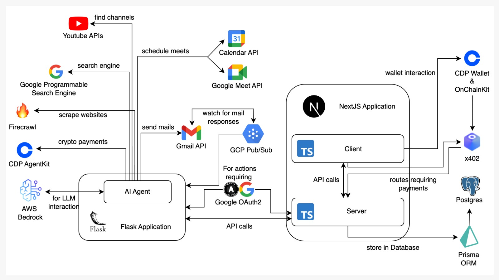

# OutreachAI 🤖

<div align="center">


**AI Agents. Real Connections.**

A comprehensive AI-powered outreach automation platform that combines intelligent candidate discovery, personalized message generation, and blockchain-based payment processing.

[](https://nextjs.org/)
[](https://reactjs.org/)
[](https://python.org/)
[](https://typescriptlang.org/)
[](https://prisma.io/)

</div>

## 🎯 Overview

OutreachAI revolutionizes professional networking and business development by combining the power of AI agents with modern web technologies and crypto payments. Whether you're a podcaster seeking guests, a founder looking for co-founders, or a marketer building relationships, OutreachAI automates the entire outreach pipeline from discovery to engagement.

### 🚀 Key Capabilities

- **Autonomous AI Agents**: Intelligent candidate discovery and scoring
- **Personalized Outreach**: AI-generated custom messages for each prospect
- **Crypto Payments**: Integrated USDC/EURC processing with x402pay technology
- **Real-time Analytics**: Live campaign tracking with Server-Sent Events
- **Multi-platform Integration**: Google Search, YouTube, Gmail, and Firecrawl web scraping

## ✨ Features

### 🎯 **Intelligent Outreach Automation**
- **AI-Powered Candidate Discovery**: Leverages AI to find potential podcast guests, influencers, co-founders, and professional connections across multiple platforms
- **Smart Scoring System**: Advanced AI-driven candidate ranking and evaluation based on relevance, engagement potential, and alignment with your criteria
- **Personalized Message Generation**: Creates custom outreach messages tailored to each prospect's background, interests, and professional profile
- **Multi-Platform Search**: Comprehensive integration with Google Search API, YouTube Data API, and intelligent web scraping via FireCrawl

### 🔐 **Authentication & User Management**
- **Google OAuth Integration**: Seamless single sign-on with Google accounts
- **Wallet-Based Authentication**: Web3 wallet integration for decentralized identity and payments

### 💰 **Blockchain Integration**
- **OnchainKit Integration**: Built on Coinbase's OnchainKit for robust Web3 functionality and wallet connections
- **Multi-Currency Support**: Native USDC and EURC payment processing with real-time exchange rates
- **x402 Protocol**: Advanced payment streaming and microtransaction capabilities
- **Decentralized Transactions**: Secure, transparent payment processing with on-chain verification

### 🚀 **Real-Time Operations**
- **Live Streaming Updates**: Real-time progress tracking via Server-Sent Events for immediate feedback
- **Session State Management**: Persistent state across user interactions with automatic recovery
- **Background Processing**: Autonomous agent operations requiring minimal user intervention
- **Queue Management**: Intelligent task scheduling and priority handling for optimal performance

### 📊 **Campaign Management**
- **Campaign Creation Wizard**: Intuitive interface for defining outreach objectives and target criteria
- **Budget Management**: Set, track, and optimize campaign budgets across multiple currencies
- **Analytics Dashboard**: Comprehensive performance metrics, conversion tracking, and ROI analysis

## 🏗️ Architecture

<div align="center">
  
  <p><em>System Architecture</em></p>
</div>

### 🖥️ Frontend Stack
- **Framework**: Next.js with App Router and Turbopack for ultra-fast development
- **UI Components**: Tailwind CSS with shadcn/ui component library for modern, accessible design
- **Database**: PostgreSQL with Prisma ORM and Accelerate for optimized queries
- **Web3 Integration**: Coinbase OnchainKit and Wagmi for seamless blockchain interactions
- **State Management**: React with modern hooks and context patterns

### 🐍 Backend Infrastructure
- **AI Engine**: Amazon Nova Lite integration for natural language processing
- **Search APIs**: Google Custom Search Engine and YouTube Data API for comprehensive data retrieval
- **Web Scraping**: FireCrawl for intelligent content extraction and analysis
- **Server Framework**: Flask with Server-Sent Events for real-time communication
- **Authentication**: Google APIs and OAuth 2.0 for secure service integration
- **Background Processing**: Asynchronous task handling with queue management

### 🔧 Infrastructure & DevOps
- **Database**: PostgreSQL with connection pooling and automated migrations
- **API Gateway**: RESTful APIs with proper error handling and rate limiting
- **Real-time Communication**: WebSocket and SSE for live updates

## 📋 Prerequisites

Before setting up OutreachAI, ensure you have the following installed and configured:

### System Requirements
- **Node.js** 18.0+ with npm, yarn, or pnpm
- **Python** 3.8+ with pip package manager
- **PostgreSQL** 14+ database server
- **Git** for version control

### Required API Keys & Services
- **Google Cloud Platform** account with the following APIs enabled:
  - Google Search API (Custom Search Engine)
  - YouTube Data API v3
  - Google Gemini API
  - Gmail API (for email integration)
- **FireCrawl API** key for web scraping capabilities
- **Coinbase** account for OnchainKit integration

## 🚀 Quick Start

### 1. Repository Setup
```bash
# Clone the repository
git clone https://github.com/ahmedfahim21/Outreach.git
cd Outreach

# Copy environment template
cp .env.example .env
```

### 2. Frontend Configuration

```bash
# Install dependencies with your preferred package manager
npm install

# Configure environment variables in .env

# Set up database
npx prisma generate
npx prisma migrate dev --name init

# Start development server with Turbopack
npm run dev
```

### 3. AI Agent Setup

```bash
# Navigate to AI Agent directory
cd "AI Agent"

# Create Python virtual environment (recommended)
python -m venv venv
source venv/bin/activate  # On Windows: venv\Scripts\activate

# Install Python dependencies
pip install -r requirements.txt

# Configure AI Agent environment variables
cp .env.example .env
# Edit .env with your API keys


# Start the AI agent server
python app.py
```

### 4. Verify Installation

Once both servers are running, access:
- **Frontend Application**: [http://localhost:3000](http://localhost:3000)
- **AI Agent API**: [http://localhost:5050](http://localhost:5050)
- **Database Studio**: `npx prisma studio` (optional)


## 📄 License

This project is licensed under the MIT License - see the [LICENSE](LICENSE) file for details.

---

<div align="center">

**OutreachAI** - AI Agents with Tools that find People — and make it happen.

</div>
